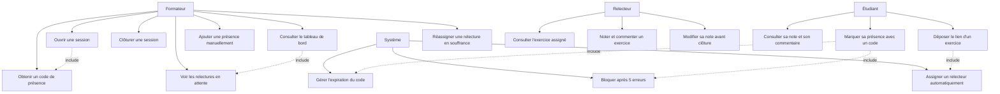

# D1 — Diagramme de cas d'utilisation

Acteurs et actions de l'application KFOKAM48 Présence & Relecture.

```mermaid
graph TB
    F[Formateur]
    E[Étudiant]
    R[Relecteur]
    S[Système]

    UC1[Ouvrir une session]
    UC2[Obtenir un code de présence]
    UC3[Clôturer une session]
    UC4[Marquer sa présence avec un code]
    UC5[Ajouter une présence manuellement]
    UC6[Déposer le lien d'un exercice]
    UC7[Consulter le tableau de bord]
    UC8[Voir les relectures en attente]
    UC9[Réassigner une relecture en souffrance]
    UC10[Consulter l'exercice assigné]
    UC11[Noter et commenter un exercice]
    UC12[Modifier sa note avant clôture]
    UC13[Consulter sa note et son commentaire]
    UC14[Assigner un relecteur automatiquement]
    UC15[Gérer l'expiration du code]
    UC16[Bloquer après 5 erreurs]

    F --> UC1
    F --> UC2
    F --> UC3
    F --> UC5
    F --> UC7
    F --> UC8
    F --> UC9

    E --> UC4
    E --> UC6
    E --> UC13

    R --> UC10
    R --> UC11
    R --> UC12

    S --> UC14
    S --> UC15
    S --> UC16

    UC1 -.->|include| UC2
    UC4 -.->|include| UC15
    UC4 -.->|include| UC16
    UC6 -.->|include| UC14
    UC7 -.->|include| UC8
```
