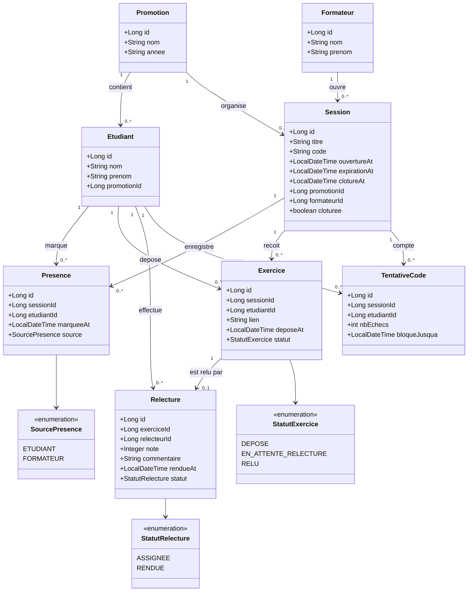

# D2 — Diagramme de classes / modèle de données

Entités, attributs et cardinalités. Ce diagramme correspond aux migrations Flyway du backend.

```mermaid
classDiagram
    class Promotion {
        +Long id
        +String nom
        +String annee
    }

    class Etudiant {
        +Long id
        +String nom
        +String prenom
        +Long promotionId
    }

    class Formateur {
        +Long id
        +String nom
        +String prenom
    }

    class Session {
        +Long id
        +String titre
        +String code
        +LocalDateTime ouvertureAt
        +LocalDateTime expirationAt
        +LocalDateTime clotureAt
        +Long promotionId
        +Long formateurId
        +boolean cloturee
    }

    class Presence {
        +Long id
        +Long sessionId
        +Long etudiantId
        +LocalDateTime marqueeAt
        +SourcePresence source
    }

    class Exercice {
        +Long id
        +Long sessionId
        +Long etudiantId
        +String lien
        +LocalDateTime deposeAt
        +StatutExercice statut
    }

    class Relecture {
        +Long id
        +Long exerciceId
        +Long relecteurId
        +Integer note
        +String commentaire
        +LocalDateTime rendueAt
        +StatutRelecture statut
    }

    class TentativeCode {
        +Long id
        +Long sessionId
        +Long etudiantId
        +int nbEchecs
        +LocalDateTime bloqueJusqua
    }

    class SourcePresence {
        <<enumeration>>
        ETUDIANT
        FORMATEUR
    }

    class StatutExercice {
        <<enumeration>>
        DEPOSE
        EN_ATTENTE_RELECTURE
        RELU
    }

    class StatutRelecture {
        <<enumeration>>
        ASSIGNEE
        RENDUE
    }

    Promotion "1" --> "0..*" Etudiant : contient
    Promotion "1" --> "0..*" Session : organise
    Formateur "1" --> "0..*" Session : ouvre
    Session "1" --> "0..*" Presence : enregistre
    Etudiant "1" --> "0..*" Presence : marque
    Session "1" --> "0..*" Exercice : recoit
    Etudiant "1" --> "0..*" Exercice : depose
    Exercice "1" --> "0..1" Relecture : est relu par
    Etudiant "1" --> "0..*" Relecture : effectue
    Session "1" --> "0..*" TentativeCode : compte
    Etudiant "1" --> "0..*" TentativeCode : genere
    Presence --> SourcePresence
    Exercice --> StatutExercice
    Relecture --> StatutRelecture
```
