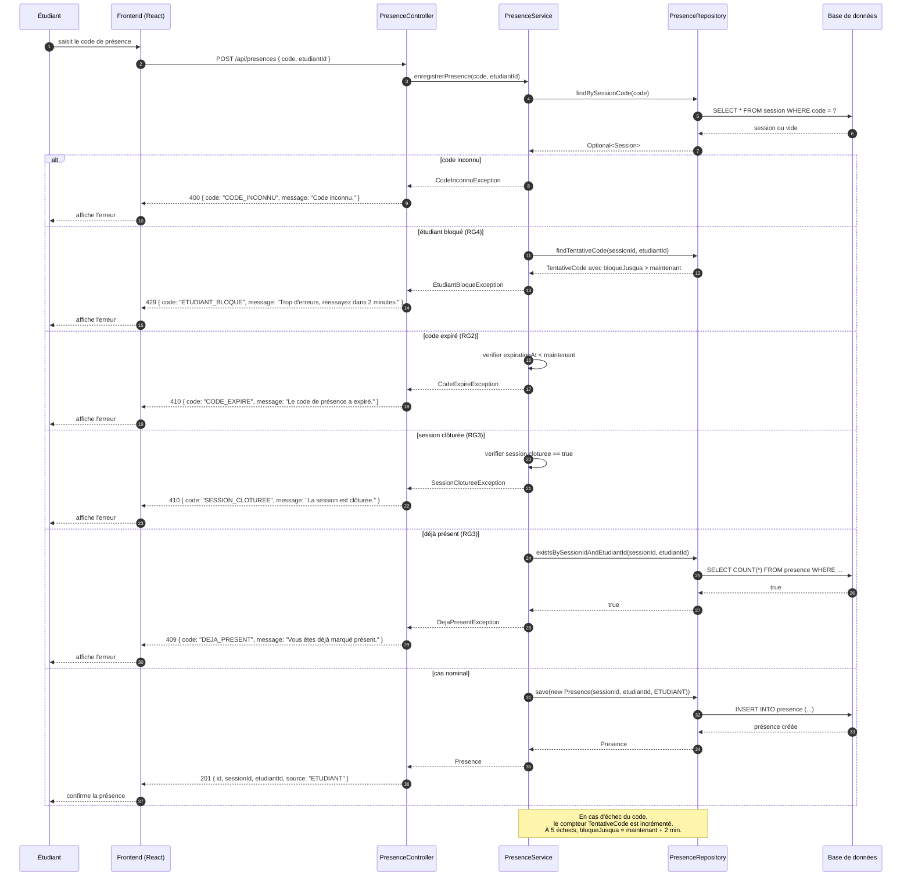

# D3 — Diagramme de séquence : marquer sa présence

Cas nominal et cas d'erreur pour `POST /api/presences`. Les codes HTTP correspondent au contrat d'API.

```mermaid
sequenceDiagram
    autonumber
    participant E as Étudiant
    participant F as Frontend (React)
    participant C as PresenceController
    participant S as PresenceService
    participant R as PresenceRepository
    participant DB as Base de données

    E->>F: saisit le code de présence
    F->>C: POST /api/presences { code, etudiantId }

    C->>S: enregistrerPresence(code, etudiantId)

    S->>R: findBySessionCode(code)
    R->>DB: SELECT * FROM session WHERE code = ?
    DB-->>R: session ou vide
    R-->>S: Optional<Session>

    alt code inconnu
        S-->>C: CodeInconnuException
        C-->>F: 400 { code: "CODE_INCONNU", message: "Code inconnu." }
        F-->>E: affiche l'erreur
    else étudiant bloqué (RG4)
        S->>R: findTentativeCode(sessionId, etudiantId)
        R-->>S: TentativeCode avec bloqueJusqua > maintenant
        S-->>C: EtudiantBloqueException
        C-->>F: 429 { code: "ETUDIANT_BLOQUE", message: "Trop d'erreurs, réessayez dans 2 minutes." }
        F-->>E: affiche l'erreur
    else code expiré (RG2)
        S->>S: verifier expirationAt < maintenant
        S-->>C: CodeExpireException
        C-->>F: 410 { code: "CODE_EXPIRE", message: "Le code de présence a expiré." }
        F-->>E: affiche l'erreur
    else session clôturée (RG3)
        S->>S: verifier session.cloturee == true
        S-->>C: SessionClotureeException
        C-->>F: 410 { code: "SESSION_CLOTUREE", message: "La session est clôturée." }
        F-->>E: affiche l'erreur
    else déjà présent (RG3)
        S->>R: existsBySessionIdAndEtudiantId(sessionId, etudiantId)
        R->>DB: SELECT COUNT(*) FROM presence WHERE ...
        DB-->>R: true
        R-->>S: true
        S-->>C: DejaPresentException
        C-->>F: 409 { code: "DEJA_PRESENT", message: "Vous êtes déjà marqué présent." }
        F-->>E: affiche l'erreur
    else cas nominal
        S->>R: save(new Presence(sessionId, etudiantId, ETUDIANT))
        R->>DB: INSERT INTO presence (...)
        DB-->>R: présence créée
        R-->>S: Presence
        S-->>C: Presence
        C-->>F: 201 { id, sessionId, etudiantId, source: "ETUDIANT" }
        F-->>E: confirme la présence
    end

    Note over S,R: En cas d'échec du code,<br/>le compteur TentativeCode est incrémenté.<br/>À 5 échecs, bloqueJusqua = maintenant + 2 min.
```
