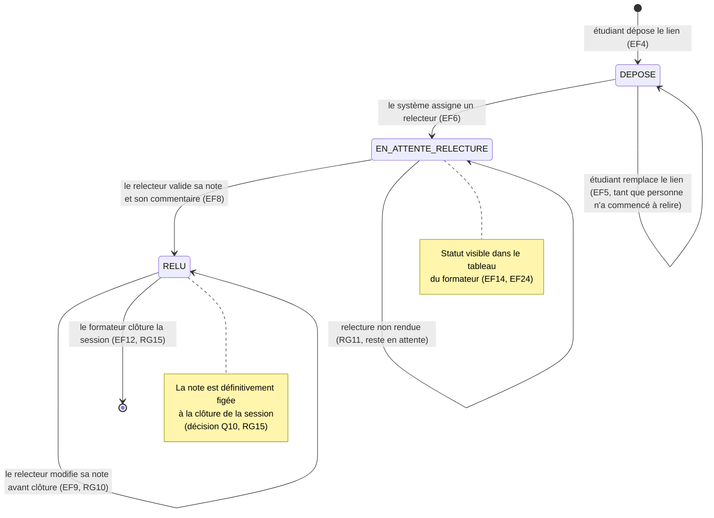

# D4 — Diagramme d'états-transitions : cycle de vie d'un exercice (bonus)

États d'un exercice et événements de transition.

```mermaid
stateDiagram-v2
    [*] --> DEPOSE : étudiant dépose le lien (EF4)

    DEPOSE --> EN_ATTENTE_RELECTURE : le système assigne un relecteur (EF6)
    DEPOSE --> DEPOSE : étudiant remplace le lien (EF5, tant que personne n'a commencé à relire)

    EN_ATTENTE_RELECTURE --> RELU : le relecteur valide sa note et son commentaire (EF8)
    EN_ATTENTE_RELECTURE --> EN_ATTENTE_RELECTURE : le relecteur modifie sa note avant clôture (EF9)
    EN_ATTENTE_RELECTURE --> EN_ATTENTE_RELECTURE : le formateur réassigne la relecture (EF13)
    EN_ATTENTE_RELECTURE --> EN_ATTENTE_RELECTURE : relecture non rendue (RG11, reste en attente)

    RELU --> RELU : le relecteur modifie sa note avant clôture (EF9, RG10)
    RELU --> [*] : le formateur clôture la session (EF12, RG15)

    note right of EN_ATTENTE_RELECTURE
        Statut visible dans le tableau
        du formateur (EF14, EF24)
    end note

    note right of RELU
        La note est définitivement figée
        à la clôture de la session
        (décision Q10, RG15)
    end note
```
